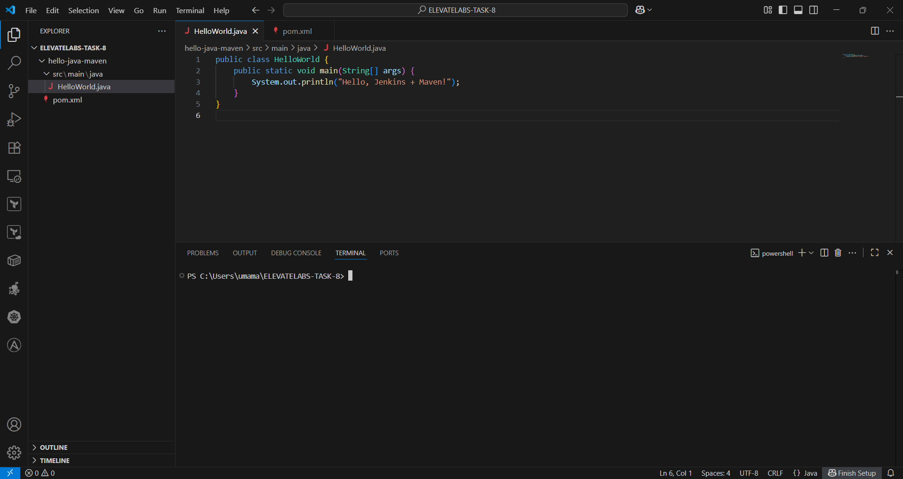
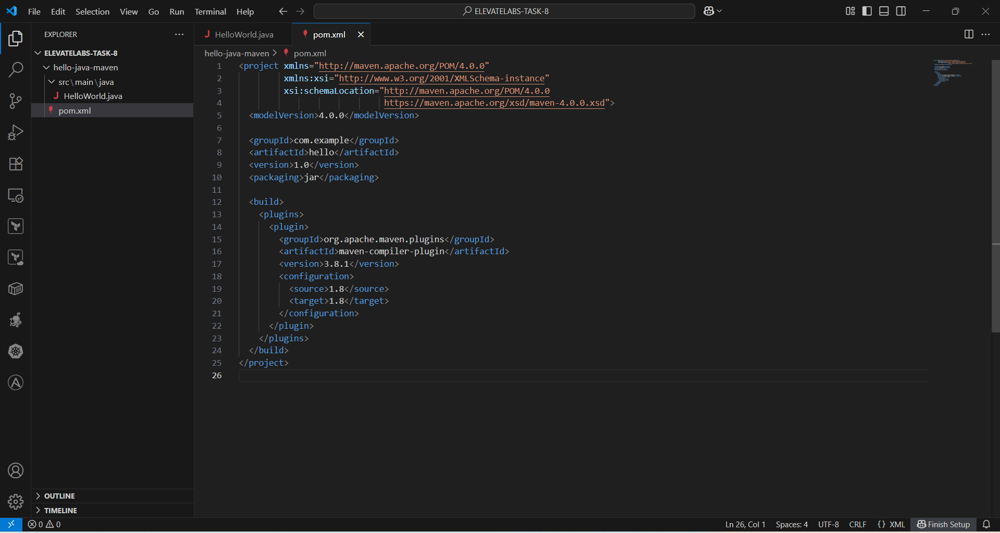
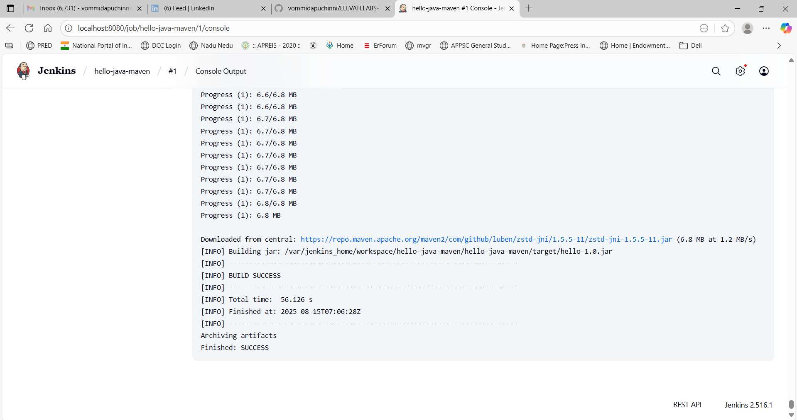
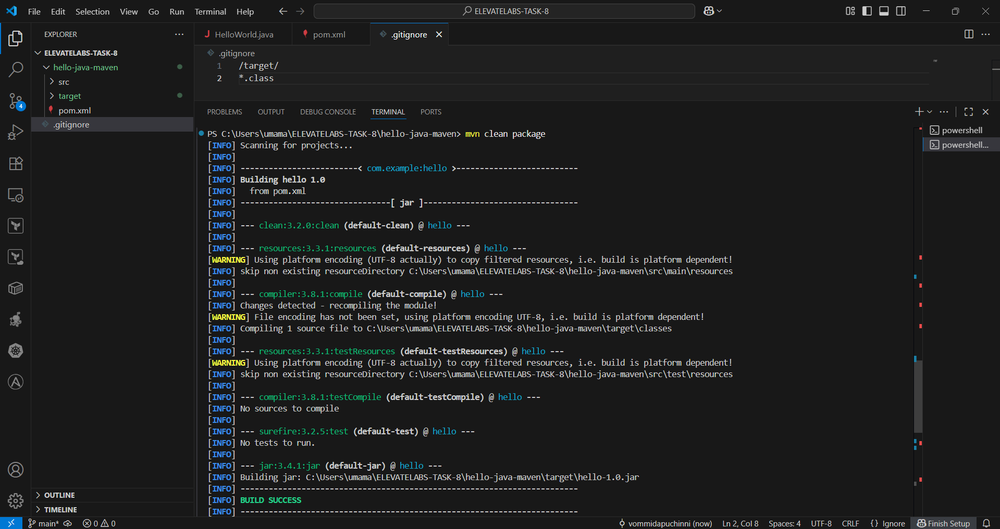
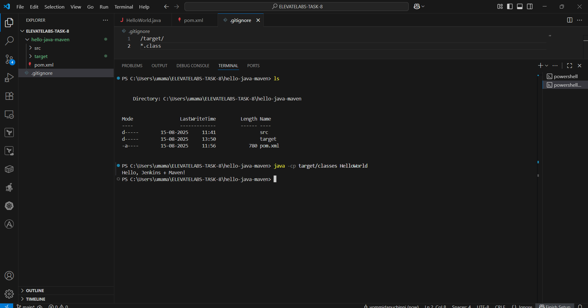

# ELEVATELABS-TASK-8

## Goal
Build a simple Java HelloWorld app with Maven and run it through Jenkins.

## Steps
1. Created HelloWorld.java  
2. Added pom.xml for Maven build  
3. Configured .gitignore to skip target/
4. Pushed project to GitHub 
5. Run Jenkins via Docker: docker run --name jenkins -p 8080:8080 -p 50000:50000 -v jenkins_home:/var/jenkins_home jenkins/jenkins:lts 
6. Created Jenkins Freestyle job → clean package  
7. Built project in Jenkins → `BUILD SUCCESS`

## Screenshots

### Java File

### POM File  

### Jenkins Build Success

### Locally Built Jar 

### Locally Accessed  

## Tools
Java | Maven | Jenkins | Git & GitHub

# The documentation file in the repository explains each step in detail with screenshots.
